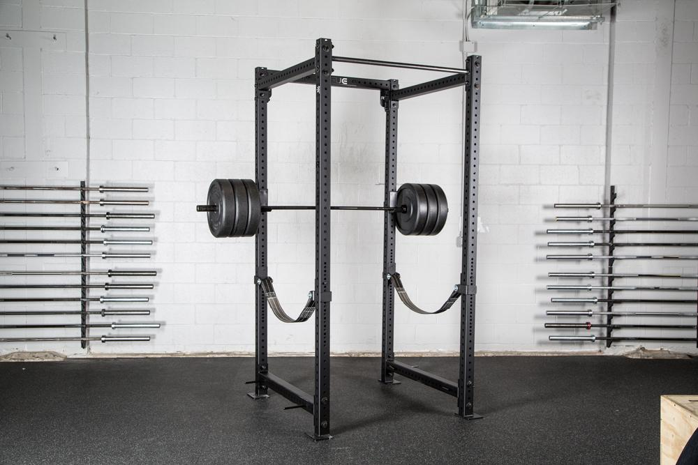
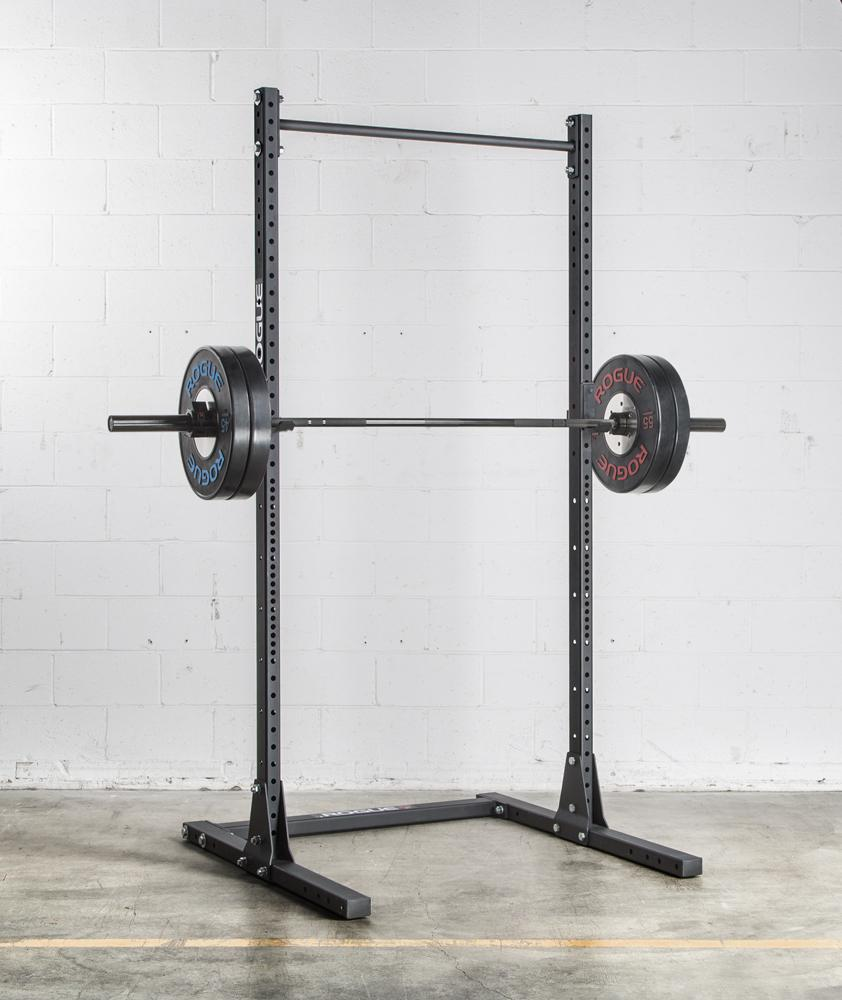
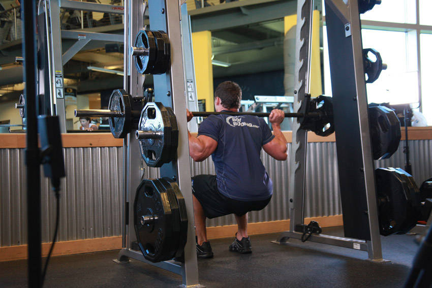

# [fit] Gordon
# [fit] ATX

^ Hey, I'm Gordon. I work in the Austin office. If you were here last year,
you know me from the creepy photo montage that Britt did.

---

# A step by step
# guide to squatting
# [fit] 400lbs

^ This is the title I put in the spreadsheet for clickbait reasons, but I
actually don't care about the weight.

---

# [fit] A
# [fit] crash course
# [fit] in how to
# [fit] squat

^ I'm more interested in trying to get more people to lift, and I think
squatting is a really fantastic thing you can do for yourself, so I just want
to talk to y'all about squatting in general.

---

# [fit] Why?

^ So why do I think squatting is so important?

---

# [fit] Full
# [fit] body
# [fit] exercise

^ Not just legs! Core and upper body are engaged for stabilization

---

# [fit] functional
# [fit] af

^ We move from sitting to standing positions all day every day. Training your
body to move properly with heavy weight will reduce the likelihood of injury
without weight.

^ Squatting properly also helps teach your body how to move through its full
range of motion under load.

^ most importantly

---

# [fit] Impress
# [fit] your
# [fit] friends

^ People can typically squat more than most other movements, so you get to
talk about big numbers, and big numbers are impressive.

---

# [fit] What?

^ What do you actually need to squat?

---

# [fit] Required

^ There are a few things that are absolutely required to be able to squat

---

# [fit] Barbell

^ This is that big metal rod you slide weights onto.
^ Men's bars weigh 45lbs or 20kg, women's bars weigh 35lbs/15kg.
^ kinda sexist I know, but this is how they are marketed
^ Lighter bars are also available.

---

# [fit] Weight

^ The stuff you put onto the bar

---

# [fit] FAQ

^ when we talk about weight, we're talking about the total weight (including
the bar itself). So if I say 95lbs, I mean that I have a barbell with a 25lb
plate on each side.

---

# [fit] Optional

^ there are also a few things that aren't required, but are helpful to have.

---

# [fit] Belt

^ Buy cheap! Mine cost $15
^ Useful for core stabilization.
^ No reason not to use them.
^ Push into it with your stomach, keeps your core tight.

---

# [fit] Knee
# [fit] sleeves

^ helps with stabilization/heat.
^ Especially useful if you have knee issues like I do.

---

# [fit] Lifting
# [fit] shoes

^ Expensive!
^ Lifts your heel, which lets your knee track over your foot more, which is a
better position.
^ If you don't have lifters, just don't lift in tennis shoes. They have
squishy soles and don't give you a stable platform to lift on.
^ Stability is key!

---

# [fit] Unnecessary

^ What don't you need to squat

---

# [fit] Bar
# [fit] padding

^ typically a foam thing you put around the bar or a plastic piece that is
supposed to go across your shoulders.
^ Just use your traps. It will be uncomfortable for a while but you'll get
used to it and it helps train you to pinch your shoulders back.

---

# [fit] Where?

^ Where do you go to squat

---

# [fit] squat
# [fit] rack

---

^ They come in a bunch of different shapes, these are two
^ the one on the left has some straps for safety in case you drop it, the one
on the right does not.
^ Don't be afraid!

---

# [fit] Where
# [fit] **not**?

^ There's one place you really shouldn't squat

---

# [fit] smith
# [fit] machines

---

^ I hate these
^ The bar slides along these poles, locking it into a horizontal movement
^ Restricts range of motion, much easier to get into an unnatural position.
^ Could this dude be in this position if he wasn't leaning back into that bar?

---

# [fit] How?

^ Cool, so now how do you lift?
^ ground up

---

# [fit] Foot
# [fit] position

^ Feet shoulder width apart
^ Toes can be straight ahead or slightly angled. Don't angle too far!

---

# [fit] knees

^ Out!
^ Track over your toes

---

# [fit] back

^ Straight
^ critically: the angle shouldn't change

---

# [fit] Head/eyes

^ Forward.
^ Body follows your head. Look down and you'll end up in a heavy
back extension, look up and you'll lean backwards.

---

# [fit] Bar
# [fit] position

^ Rest the bar across your traps/shoulders
^ no weight on your neck

---

# [fit] Grip

^ just wider than shoulder width, full grip, elbows back.

---

# [fit] Time
# [fit] to
# [fit] shine

^ we're ready

---
# [fit] squat!

1. Big breath
2. Controlled descent
3. Beyond parallel
4. Maintain back angle
5. Vertical bar path

^ take a big breath to stabilize your core
^ control your descent! You don't want to crash in the bottom
^ Go past parallel for full range of motion
^ Maintain back angle throughout the lift
^ Keep your chest up while pressing
